# Инструкция по работе в ERP-системе
---

## 1. Как открыть систему

1. Откройте ссылку, которая используется в вашей компании или на сервере.
2. Войдите в систему под своим логином и паролем.
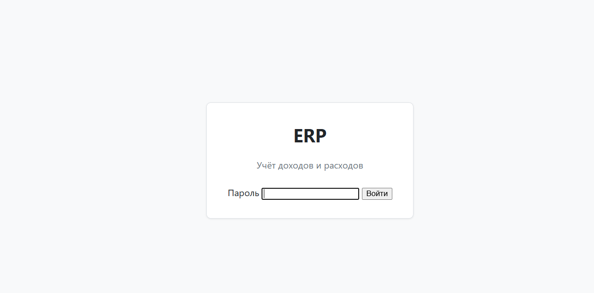

3. После входа откроется главное меню и рабочая область.

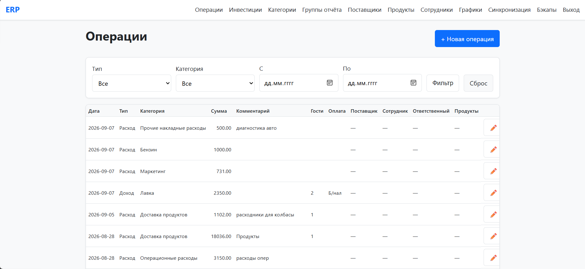

### В интерфейсе обычно есть:
- меню разделов слева или сверху;
- таблицы со списками данных;
- кнопки добавления, редактирования и удаления;
- панель статистики и фильтров.

---

## 2. Основные разделы системы

В обычной работе вы чаще всего используете следующие разделы:

- Операции
- Категории
- Поставщики
- Сотрудники
- Продукты
- Статистика
- Синхронизация
- Резервные копии

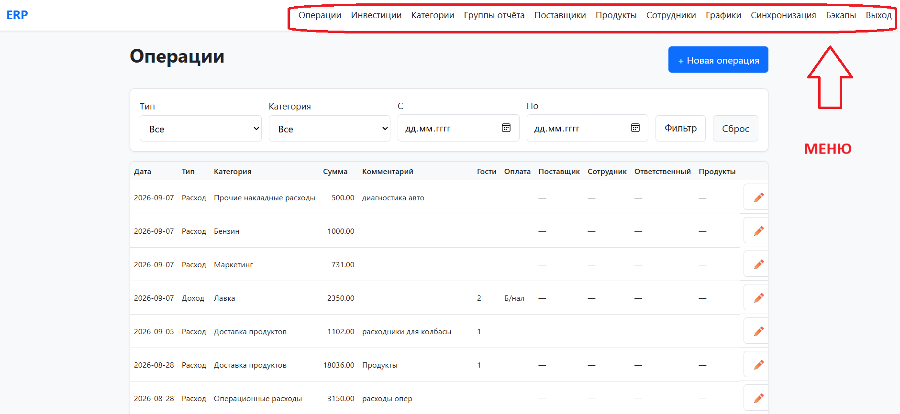

Если вам нужно внести новую финансовую запись — открывайте раздел "Операции". Если требуется поправить справочник — раздел "Категории" или "Поставщики".

---

## 3. Как создать новую операцию

### Шаги
1. Откройте раздел "Операции".
2. Нажмите кнопку "Новая операция".

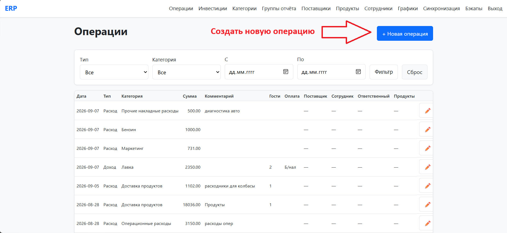
3. Заполните поля:
   - дата;
   - тип операции: доход или расход;
   - категория;
   - сумма;
   - комментарий;
   - способ оплаты, если требуется;
   - поставщик, сотрудник или другие доп. поля, если они появились.
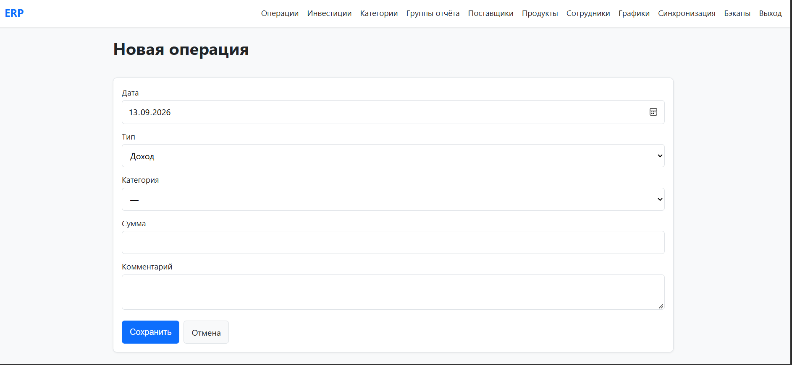
4. Нажмите "Сохранить".
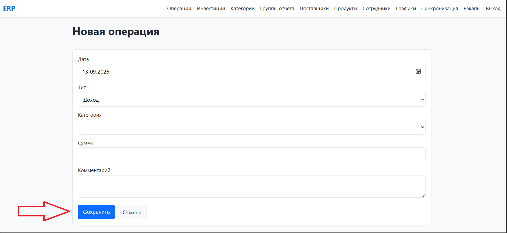

### Важно
Некоторые категории требуют дополнительных данных. Если после выбора категории появились новые поля, их нужно заполнить обязательно.

---

## 4. Как выбрать категорию правильно

1. В поле "Категория" откройте выпадающий список.
2. Выберите подходящую категорию.
3. Если система предлагает выбрать подкатегорию, выберите и её.

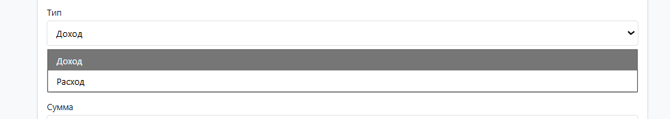
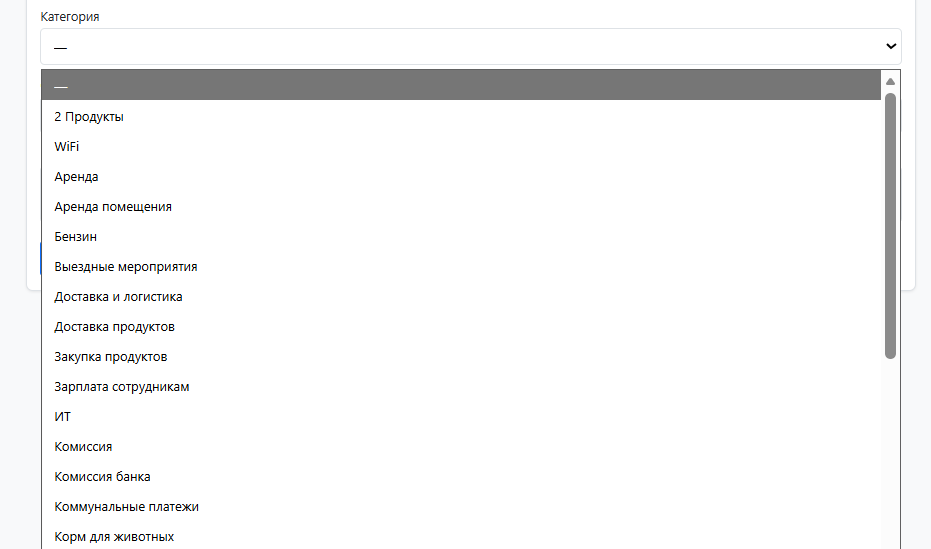

### Полезное правило
- выбирайте категорию как можно точнее;
- не оставляйте пустую категорию в финансовой операции;
- если категория отличается по типу доход/расход, проверьте это перед сохранением.

---

## 5. Как посмотреть список операций

1. Откройте раздел "Операции".
2. Перед вами появится таблица со всеми записями.
3. Можно отфильтровать записи по периоду, типу, категории и другим параметрам.

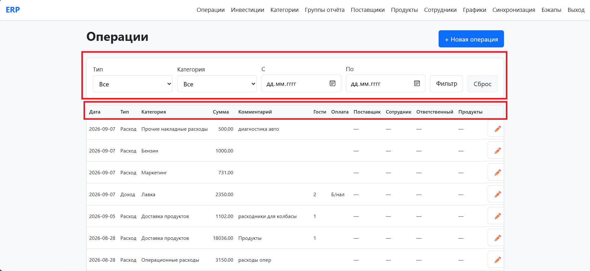

### Что обычно видно в таблице
- дата;
- тип сделки;
- категория;
- сумма;
- комментарий;
- способ оплаты;
- поставщик или сотрудник, если применимо.

---

## 6. Как отредактировать или удалить операцию

### Редактирование
1. Найдите нужную строку в таблице.
2. Нажмите кнопку редактирования.
3. Исправьте данные.
4. Сохраните изменения.

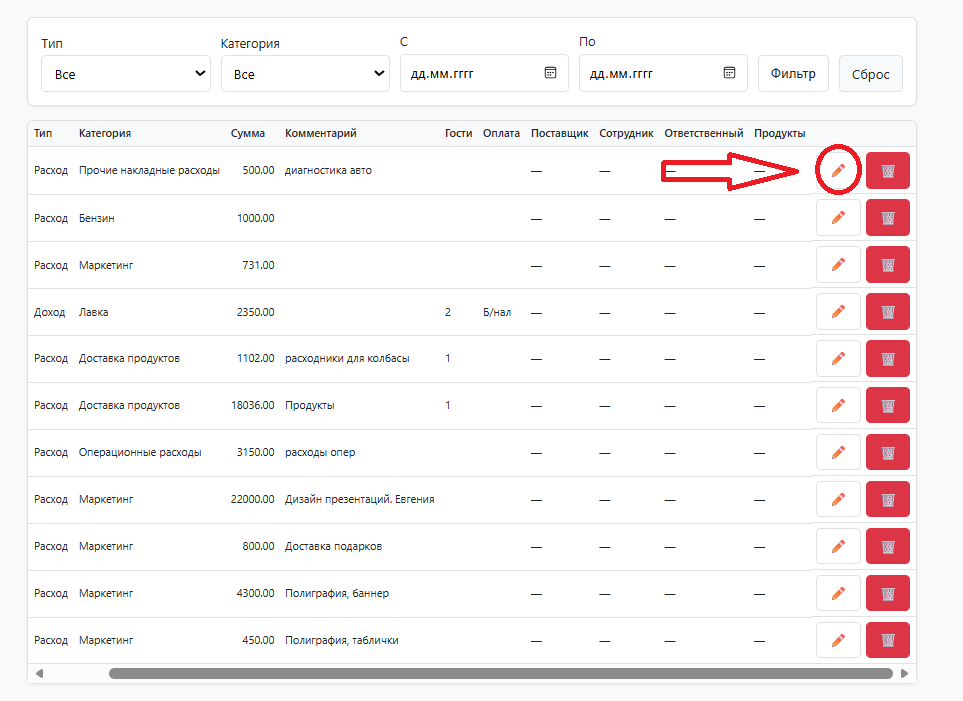

### Удаление
1. Найдите нужную операцию.
2. Нажмите кнопку удаления.
3. Подтвердите действие.

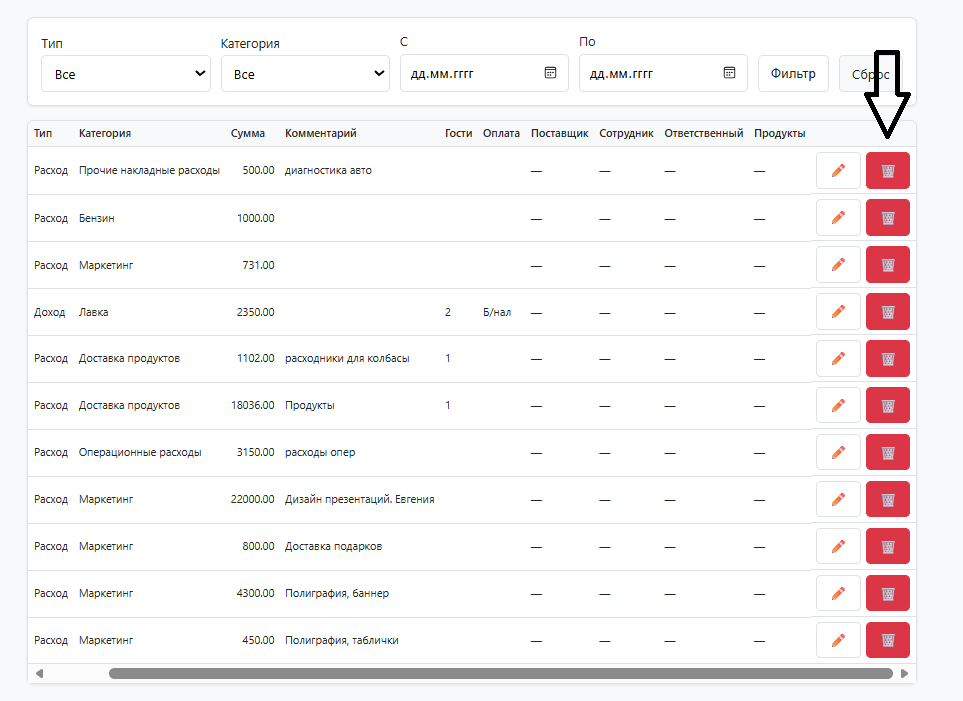

> Перед удалением лучше проверить, что это не ошибка: после удаления операция не восстанавливается автоматически.

---

## 7. Как работать со справочниками

### Категории
Открывайте раздел "Категории", если нужно:
- добавить новую категорию;
- изменить тип (доход/расход);
- указать родительскую категорию;
- настроить обязательные доп. поля.

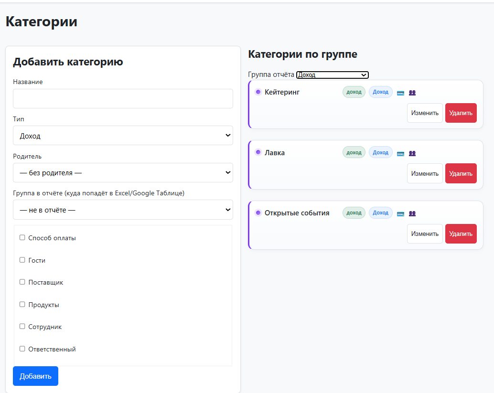

### Поставщики
Используйте раздел "Поставщики", когда нужно:
- добавить нового поставщика;
- привязать его к расходной операции;
- хранить контактные данные.

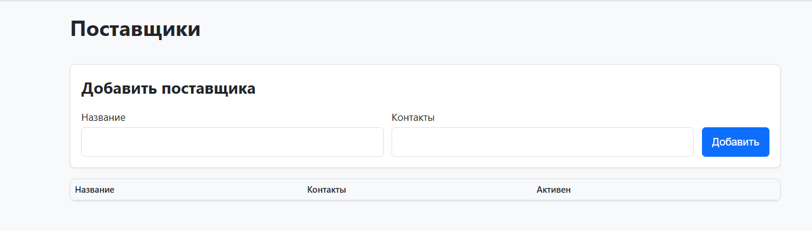

### Сотрудники
Раздел "Сотрудники" нужен для указания ответственных лиц или участников операций.

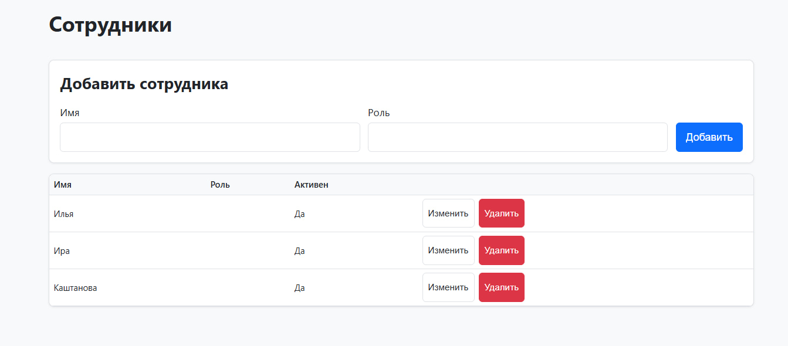

### Продукты
Раздел "Продукты" используется для учёта товаров и позиций, которые затем участвуют в операциях.

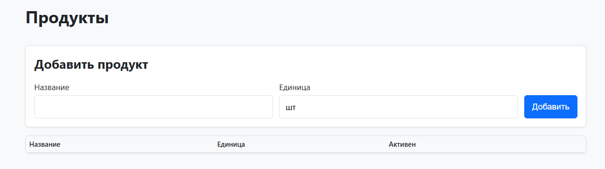

---

## 8. Как использовать цены и товары в операциях

Если в вашей работе нужно учитывать закупку товаров или услуг у поставщиков, используйте связанные справочники:

- продукт;
- поставщик;
- цена товара у поставщика.

Это позволяет быстро и без ошибок вводить операции, не переписывая цену вручную каждый раз.

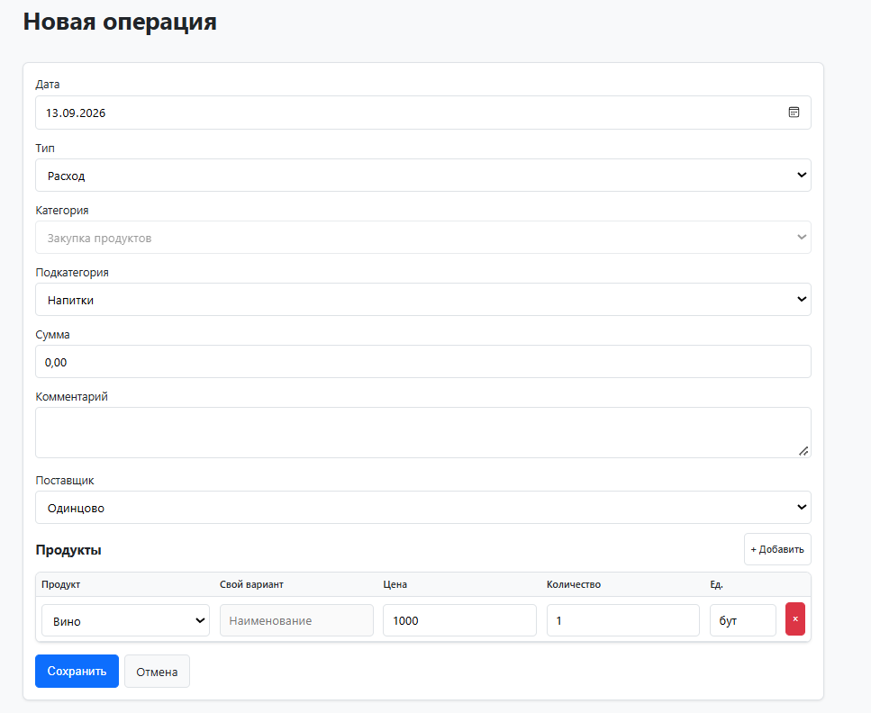

---

## 9. Как смотреть статистику и графики

1. Откройте раздел "Графики".
2. Вы увидите:
   - общий доход;
   - общий расход;
   - баланс;
   - графики по периодам;
   - распределение по категориям.

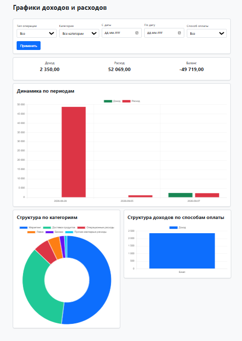

### Что важно понимать
- Доход — всё, что пришло;
- Расход — всё, что ушло;
- Баланс — разница между доходом и расходом.

Если после фильтрации данных ничего не отображается, проверьте диапазон дат и выбранные параметры.

---

## 10. Как пользоваться фильтрами в графике

На странице графики обычно доступны следующие фильтры:
- тип операций: всё / доход / расход;
- категория;
- период: от и до;
- способ оплаты.

С их помощью можно быстро посмотреть конкретный сегмент бизнеса:
- доходы по месяцу;
- расходы по категории;
- операции за период по методу оплаты.

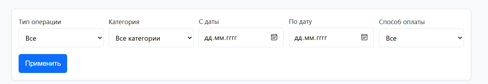

---

## 11. Как проверить отчёт по месяцам

Если вам нужен сводный финансовый взгляд, используйте раздел со сводкой или отчётом.

1. Откройте "Таблица"
2. Сравните доходы, расходы и итоговую прибыль.

---

## 12. Как синхронизировать данные с Google Таблицей

Если Google Таблица подключена к системе, данные из ERP могут автоматически выгружаться в таблицу.

### Как это выглядит в работе
1. Откройте раздел "Синхронизация".
2. Проверьте, что синхронизация включена.
3. Нажмите кнопку "Синхронизировать сейчас", если нужно обновить данные вручную.
4. Проверьте, что таблица обновилась.

### Что обычно появляется в Google Таблице
- лист "Отчет";
- лист "Операции".

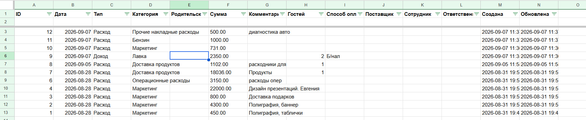

> Если данные не появились, проверьте доступ к таблице и корректность ID таблицы.

---

## 13. Что такое лист "Отчет" и лист "Операции"

### Лист "Отчет"
Это сводка по финансовым показателям: доходы, расходы, прибыль и структура по категориям.

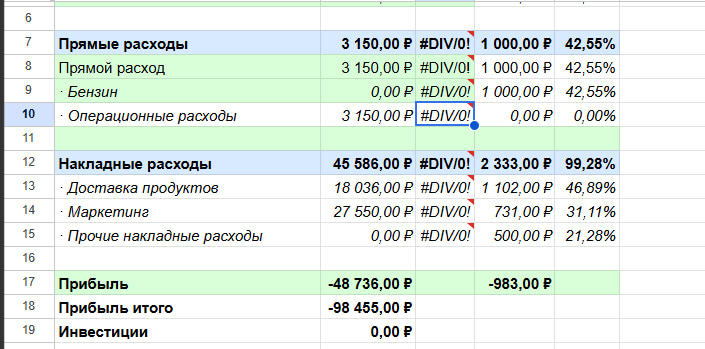

### Лист "Операции"
Это полный список всех записей, которые были добавлены в ERP.

Эти листы нужны для выгрузки данных в удобный для анализа формат и дальнейшей работы с ними в Google Sheets.

---

## 14. Как сделать резервную копию

1. Откройте раздел "Резервные копии".
2. Нажмите кнопку создания копии.
3. Дождитесь завершения операции.

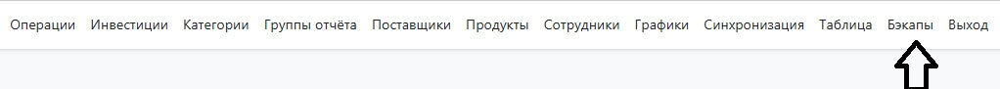
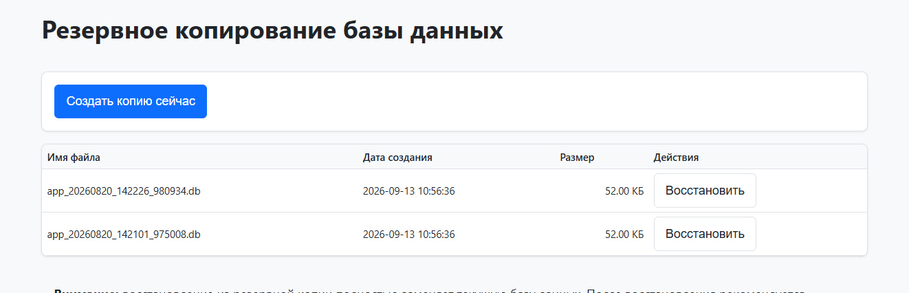

### Когда это важно
- перед массовыми исправлениями;
- перед восстановлением данных;
- после больших изменений в справочниках;
- в конце рабочего дня, если вы работаете с важными данными.

---

## 15. Как восстановить резервную копию

1. Откройте раздел "Резервные копии".
2. Выберите нужную копию.
3. Нажмите "Восстановить".
4. Подтвердите действие.

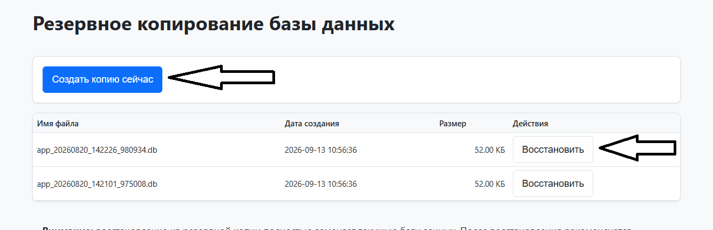

> Важно: восстановление возвращает данные к состоянию на момент создания копии. Это может изменить текущие записи, поэтому используйте это осторожно.

---

## 16. Что делать, если что-то не работает

### Проверьте в таком порядке
1. Система запущена и доступна по ссылке.
2. Вы вошли под корректным пользователем.
3. Убедитесь, что нужный раздел открыт.
4. Проверьте фильтры и даты.
5. Если это синхронизация — проверьте доступ к Google Таблице.
6. Если данные не обновляются — посмотрите журнал синхронизации или резервные копии.

### Частые причины проблем
- неверная ссылка или сервер недоступен;
- фильтры слишком жёсткие;
- нет доступа к Google Таблице;
- синхронизация выключена;
- данные были изменены вручную и не сохранены.

---

## 17. Рекомендации по ежедневной работе

### Каждый день
- вносите операции сразу после события;
- проверяйте корректность категорий;
- следите за суммами и комментариями;
- контролируйте дубли и ошибки в справочниках.

### Раз в неделю
- сверяйте статистику с реальными данными;
- проверяйте, что доходы и расходы отражены корректно;
- убеждайтесь, что синхронизация работает.

### Раз в месяц
- проверяйте итоговые отчёты;
- сверяйте данные с фактическими финансовыми результатами;
- обновляйте справочники при изменении структуры бизнеса.

---

## 18. Краткая памятка

Если нужно быстро вспомнить, как работать в системе:

1. Войдите в ERP.
2. Откройте раздел "Операции".
3. Добавьте новую запись.
4. Выберите правильную категорию и сумму.
5. Проверьте статистику.
6. Сверяйте данные в Google Таблице при необходимости.
7. Держите резервные копии актуальными.

---

## 19. Итог

Когда проект уже запущен, ERP-система обычно используется как рабочий инструмент для ежедневного учёта и анализа:

- фиксировать операции;
- проверять доходы и расходы;
- поддерживать справочники;
- анализировать статистику;
- выгружать данные в Google Таблицу;
- сохранять резервные копии.

Это помогает вести расчёты аккуратно, быстро и без ручного копирования информации.

---

## 20. Полезные термины

### Операция
Запись о доходе или расходе.

### Категория
Группа, к которой относится операция.

### Синхронизация
Автоматическая выгрузка данных в Google Таблицу.

### Резервная копия
Копия данных на случай потери или ошибки.

---

## 21. Полезный совет

Если вы сомневаетесь, всегда лучше:
- вносить операции сразу;
- проверять категорию перед сохранением;
- не оставлять пустые обязательные поля;
- периодически смотреть статистику и синхронизацию.

Так работа в ERP будет стабильной, понятной и без лишних ошибок.
